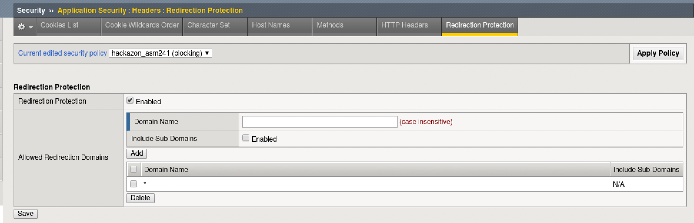
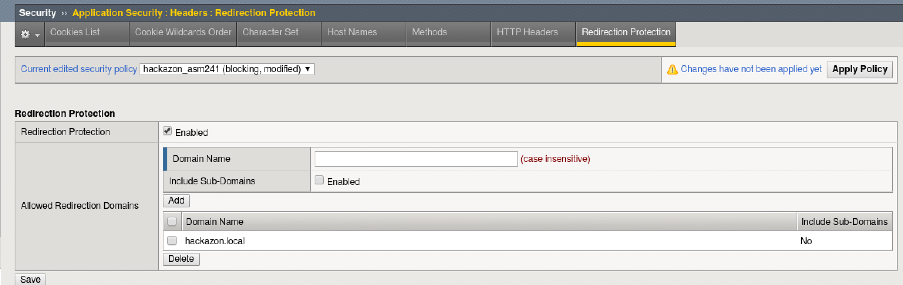

Lab 5: HTTP Redirect Protection
----------------------------------------

Connect to the lab environment
~~~~~~~~~~~~~~~~~~~~~~~~~~~~~~

#. From the jumpbox, launch Chrome, click the BIG-IP bookmark and login to TMUI. admin/f5DEMOs4u

#. Open a second tab for use with the Hackazon App

Test HTTP Redirection Behavior
~~~~~~~~~~~~~~~~~~~~~~~~~~~~~~

#. Browse to http://hackazon.local/user/login

#. Login as ‘f5student’ with the proper password

#. You are logged in normally and view your account.

#. Click the “Logout” button in the top right.

#. Browse to http://hackazon.local/user/login?return_url=http://webgoat.local/WebGoat/login and login again as ‘f5student’ with the proper password.

.. note::
	Upon successful login you are taken to the WebGoat site.  
	Any URL can be placed in the “return_url” parameter and the Hackazon site will redirect the user to it after they login.
	This is commonly used in phishing attacks to get the user to visit malicious sites.

Edit the Security Policy
~~~~~~~~~~~~~~~~~~~~~~~~

#. On the BIG-IP TMUI Go to Security > Application Security > Headers > Redirection Protection

#. Verify that the “Current edited security policy” says “hackazon (blocking)”

#. The policy currently allows for redirection to any domain.

.. note::
	This is the default behavior for a fundamental security policy and should always be adjusted for your Application

#. Add redirection protection to the policy by only allowing the site domain name. In the Domain Name field, type “hackazon.local” and click “Add”.

#. Click the checkbox next to “*” and click the Delete button.

#. Click Save, then click Apply Policy and OK

 
Test HTTP Redirection Protection
~~~~~~~~~~~~~~~~~~~~~~~~~~~~~~~~

#. Browse again to http://hackazon.local/user/login?return_url=http://webgoat.local/WebGoat/login

.. note::
	you may have to logout first and then go to the URL again.  Even though you were redirected to the other site, you were still logged in to Hackazon.

#. Login again as ‘f5student’ with the proper password.

#. You should get a block page.

..image:: images/blocked.png

#. On the BIG-IP, go to Security, and click on Event Logs.

#. You should see the HTTP redirect event, “Illegal redirection attempt”, blocked and logged.

..image:: images/redir_illegal.png
