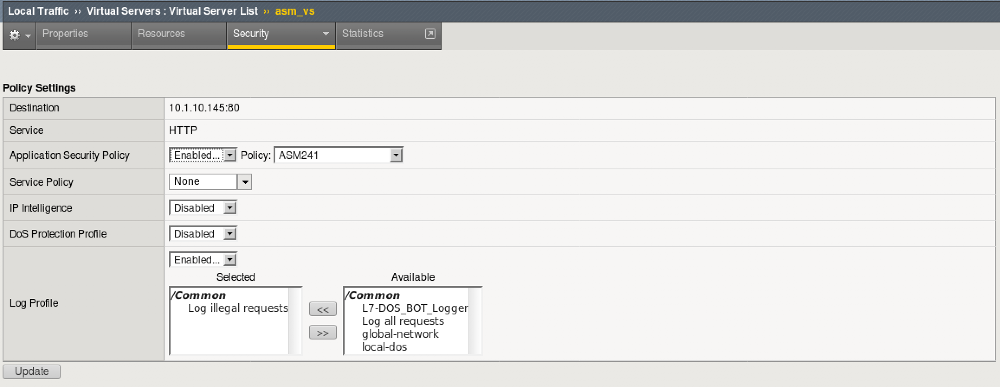

Lab 7: Disallowed File Types
----------------------------------------

In this lab you will configure a a security policy in ASM to block vulnerable components based on a file type

Connect to the lab environment
~~~~~~~~~~~~~~~~~~~~~~~~~~~~~

#. From the jumpbox, launch Chrome, click the BIG-IP bookmark and login to TMUI. admin/f5DEMOs4u

#. Open a second tab for use with the WebGoat App

Take a look at the WebGoat object
~~~~~~~~~~~~~~~~~~~~~~~~~~~~~~~~~

#. Browse to http://10.1.10.145/WebGoat/login and login as “f5student”.

#. On the left menu click Vulnerable Components – A9, then click Vulnerable Components.

#. Note the Software Supply Chain .png graphic in the middle of the page.

.. note:: 
	This is a .png file we are going to block using the BIG-IP ASM policy control “Disallowed File Types”.

Edit the Security Policy
~~~~~~~~~~~~~~~~~~~~~~~~

#. On the BIG-IP TMUI, go to Local traffic > Virtual Servers > asm_vs

#. Click the Security tab and make sure "Application Security Policy" is set to "asm241"

#. Make sure the logging Profile is set to "Log Illegal Requests"

#. Go to Security > Application Security > File Types > Disallowed File Types

#. Click the Create button on the right side.

#. Type “png” in the File Type (Explicit only) box and click Create

#. Click Apply Policy in the top right, then click OK.

Test File Type Protection
~~~~~~~~~~~~~~~~~~~~~~~~~

#. Browse again to http://10.1.10.145/WebGoat/login and login as “f5student” or use the bookmark.

#. On the left menu click Vulnerable Components – A9, then click Vulnerable Components.

#. The Software Supply Chain .png graphic does not load, because it is blocked by the ASM Disallowed File Types setting blocking .png files.

.. images:: images/blockedpng.png

#. What other applications are there for this type of policy?
