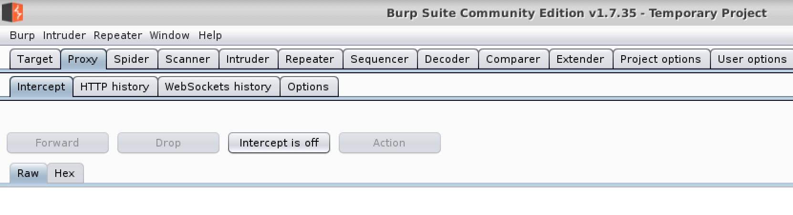
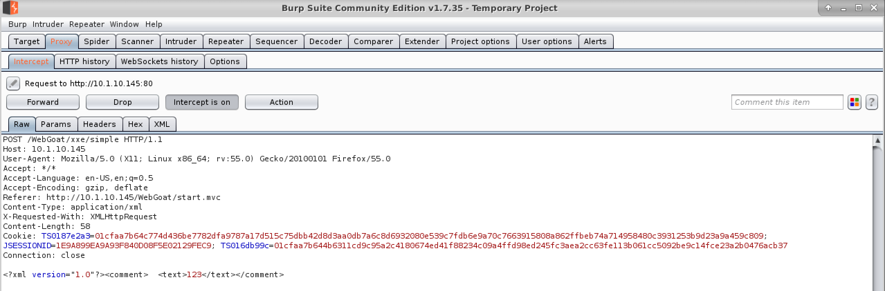
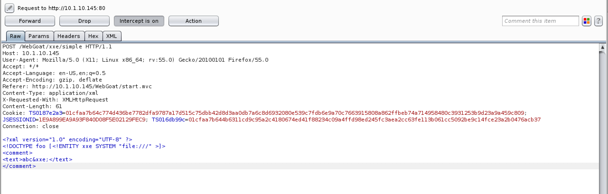
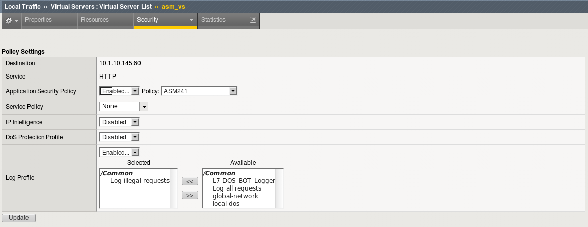
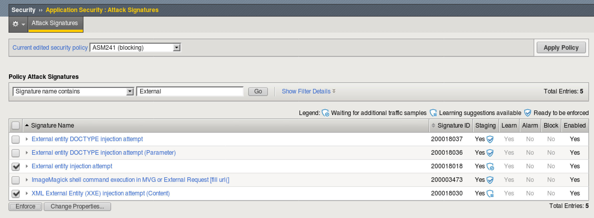
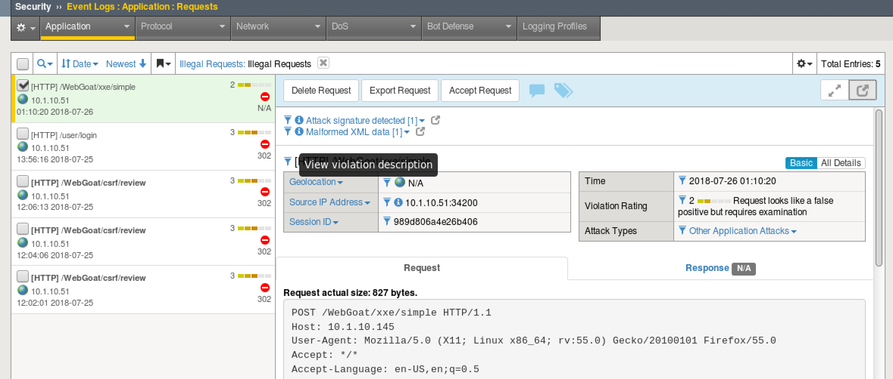

Lab 8: XXE Protection
----------------------------------------

In this lab you will learn how to utilize ASM to mitigate the use of malicious XML External Entities

Connect to the lab environment
~~~~~~~~~~~~~~~~~~~~~~~~~~~~~~

1. From the jumpbox, launch chrome, click the BIG-IP bookmark and login to TMUI. admin/f5DEMOs4u

.. note::
	While you can use firefox for connecting to the BIG-IP in this lab, you will be intercepting firefox traffic.
	It may be easier to use two browsers instead of two tabs.

2. From the jumpbox, launch firefox, which we will use to access WebGoat.

3. From the jumpbox desktop, launch Burp Suite. 

  - Select Temporary Projects and click Next.
  - Leave Defaults checked and click "Start Burp"
  - Select the "Proxy" tab and then turn intercept off.

An XXE Vulnerability
~~~~~~~~~~~~~~~~~~~~

1. Login to WebGoat using firefox f5student/f5DEMOs4u!

2. Select "Injection Flaws" and then select "XXE"

3. If XML or XML External Entities are new to you, then please start from the begging and read through parts 1 and 2 in the WebGoat Lesson.

4. Under part 3, enter a comment to familiarize yourself with the application.
*The to complete the lesson, you will need to figure out how the list the contents of the root directory utilizing this submission form.*

5. Enter the following statment in the field and click submit. What does this tell us?

:: &xxe;

6. So we know that an XML External Entity can be utilized with this form, but we will need to manipulate a request.

Manipulating the Request
~~~~~~~~~~~~~~~~~~~~~~~~

1. In Burp Suite turn Intercept back to on.

.. note::
	The firefox browser is being pointed to localhost as a proxy and therefore Burp may intercept the request.

2. submit another comment using something simple like "test" or "abc"

3. Burp should come back to the front, but if not switch to Burp to examine the request.

4. Edit the request with the following XML

.. code block:: xml

<?xml version="1.0" encoding="UTF-8" ?>
<!DOCTYPE foo [<!ENTITY xxe SYSTEM "file:///" >]>
<comment>
<text>abc&xxe;</text>
</comment>

*There should be an XML document on your desktop named xxe which you may paste from to save time, but please read and understand the request.*

5. Click Forward to pass the request on to the server and make sure you forward any remaining requests before turning intercept back off.

6. What was the result?

Mitigate an XXE attack
~~~~~~~~~~~~~~~~~~~~~~

1. Login to the BIG-IP as before with admin/f5DEMOs4u!

2. Browse to Local Traffic > Virtual Servers > asm_vs and select "Policies" under the security tab

3. Make sure "ASM241" is selected as your Application Security Policy and that you have "Log Illegal Requests" as your Log Profile

4. Go to Security > Application Security > Attack Signatures and make sure your current edited policy is ASM241.

5. Under Policy Attack Signatures, select "Signature name contains" and enter "External" before clicking Go

6. Select the following signatures and click enforce.

7. Using Burp suite and firefox, turn intercept back on and run the same test, maipulating the request. What happens this time?

Check your logs
~~~~~~~~~~~~~~~

1. On BIG-IP go to Application Security > Event Logs

2. You should see an entry that trigger the now enforced Attack Signatures.

3. What is another way that ASM could be used to mitigate XXE injection?

*Hint: Take a look at the Application Security > Content Profiles > XML Profiles*
*The Default profile is applied to all http and https requests*

